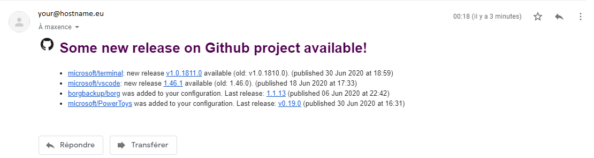

What for?
=========

This project is a simple Python script to send a email when tracked Github projects (specified in conf) have a new release.
The purpose is to use this script in a cron table.

Unbelievable, but I haven't found an existing equivalent!

Why using configuration?...
------------------------
...instead use stared project of your Github account?
Cause I've got about 80 "stared" projects and I don't wan't to be alerted for new releases of each of these project.
But, perhaps I'll add such a feature later on...

And, Github API limits is at 60 requests by seconds, and I want to write this script really quickly in a first time.

How to use?
-----------
Really simple!

* Edit conf.ini file to set `[config]` section
  * your SMTP server configuration (host and port)
  * sender mail
  * receiver mail (:warning: not tested with more than 1 receiver)
* Add the projects you want to follow in the section `[project]`
  * Be careful to follow a JSON valid syntax as in the provided file, i.e. coma after each `autor/project` except the last one.

After first execution, the `conf.ini` file will be filled with last release tag found by the script, as you can see in the provided file.

Hope you like, and have fun to read your mail!

Problems I have to solve really quickly
---------------------------------------
I wrote this script really quickly, certainly faster than this README. So I already have two big proglems:
* The script sends mail even if no new projets or release has been detected
* The biggest, you have to edit script to specify absolute path...
* A lot of other little problems, like the code that's disgusting and so on.

For who's asking: yes, it's normal that I have put all code in one main function [like a blind gunner.](https://media.giphy.com/media/1yMexL5rkwYhuiVEmZ/giphy.gif). Really quickly I said!

But overall, the script works and sends mail!

Hey boy, what is the `pit.db` file?
-----------------------------------
Oh, just for fun, and because I love this project, I use [pit by michaeldv](https://github.com/michaeldv/pit) to follow my task etc.

It makes me think I should push my python version of this project on occasion when I will take the time to do...

